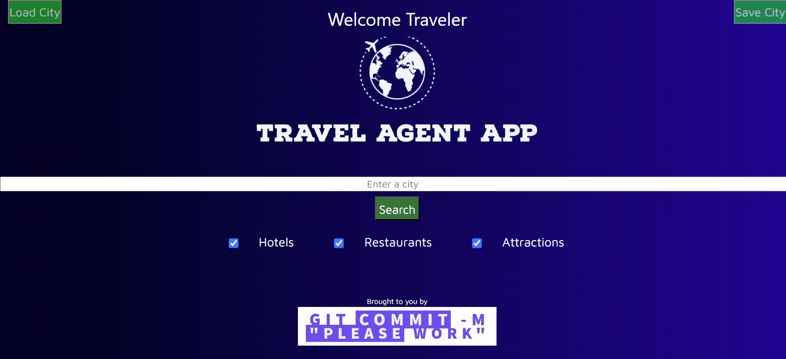
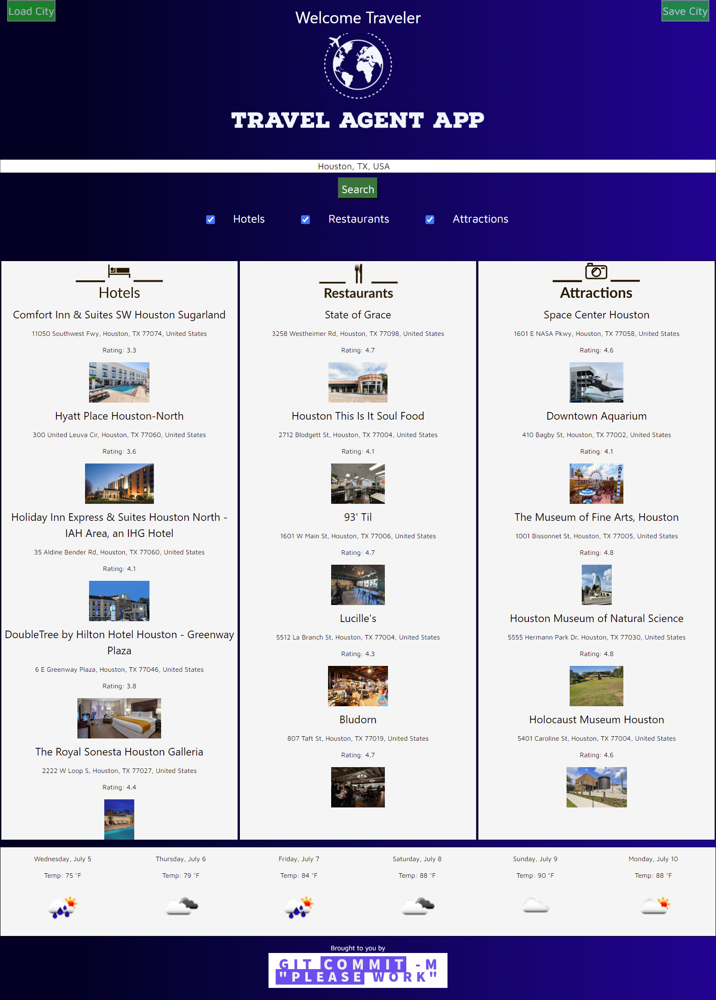

# Travel Planner

A web application for planning your travels and exploring cities. It allows users to search for cities and retrieve information about hotels, restaurants, attractions, and current weather. Users can toggle the display of different types of places, save locations for quick access, and view detailed information about each place.

## Motivation

The Travel Planner project was created to provide users with a convenient way to plan their travels and explore cities. It aims to simplify the process of finding information about hotels, restaurants, attractions, and weather for any desired location.

## Build Status

[Github URL](https://github.com/Coridane/travelagentapp)  
[Deployed Application](https://coridane.github.io/travelagentapp/)

## Code Style

The code follows the JavaScript Standard Style for maintaining a consistent coding style throughout the project.

## Screenshots

Mock of default page:

Mock of results page:

## Tech/Framework Used

- HTML
- CSS
- JavaScript
- Google Places API
- OpenWeatherMap API

## Features

- Search for cities and retrieve information about hotels, restaurants, and attractions.
- Toggle the display of different types of places using checkboxes.
- Save locations for quick access later.
- View detailed information about each place, including photos and ratings.
- Get current weather information for the city.
- Responsive design for optimal viewing on different devices.

## Credits

 -https://jsfiddle.net/ruben2079/a7nrspaj/
 -https://www.w3schools.com/w3css/default.asp
 -https://openweathermap.org/
 -https://developers.google.com/maps/documentation/places/web-service/overview
